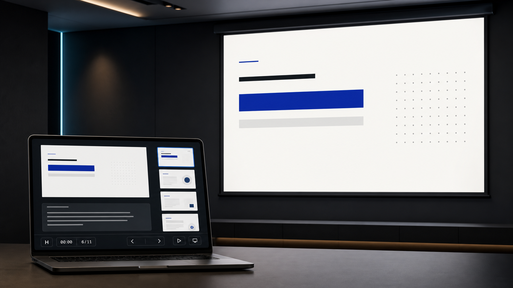
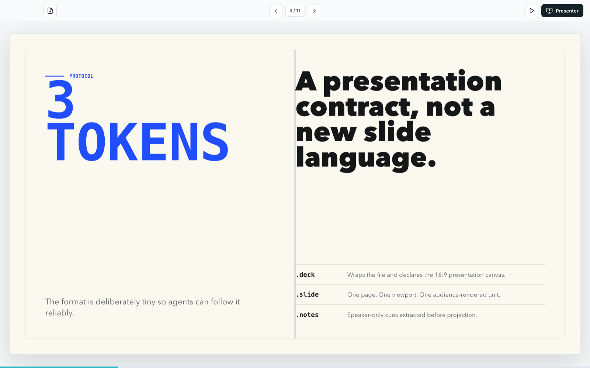
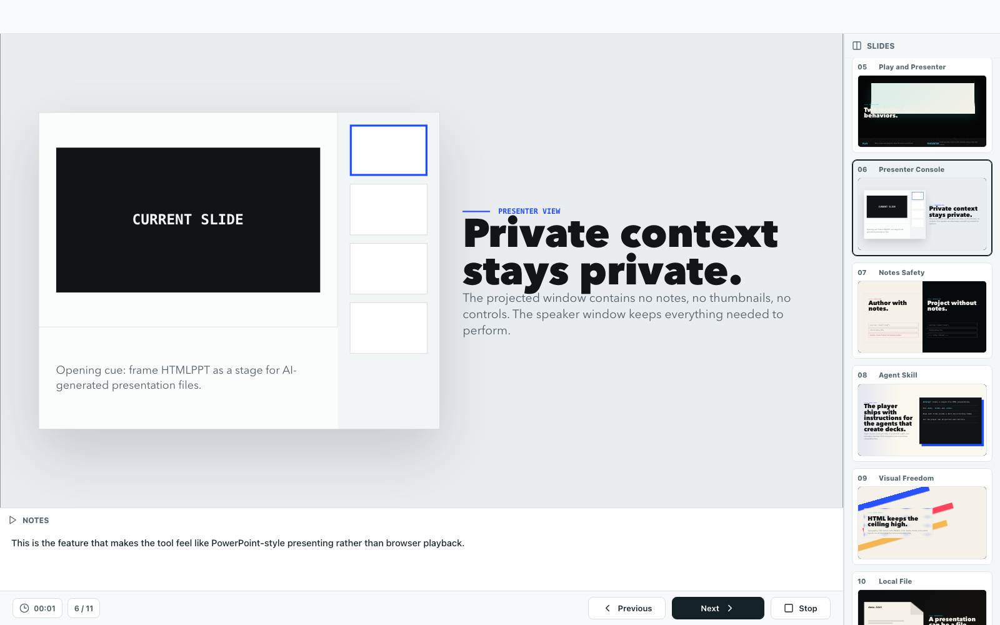

# HtmlPPT Player

[中文说明](README.zh-CN.md)

HtmlPPT Player is a desktop app for presenting local HTML slide decks without browser tabs, address bars, or visible URLs.

It is built for a new workflow: ask an AI agent to create a single-file HTML presentation, then open it in a real presentation player with fullscreen playback, presenter notes, thumbnails, timer, and projection separation.

## Preview







## Download

Download the latest app from GitHub Releases:

```text
https://github.com/chenggang928/htmlppt-player/releases/latest
```

Available builds:

- macOS arm64: `.dmg`
- Windows x64: `.exe` installer

Current builds are unsigned. macOS Gatekeeper or Windows SmartScreen may show a warning on first open.

## How To Use

1. Download and open HtmlPPT Player.
2. Open or drag in a local `.html`, `.htm`, or `.htmlppt` presentation file.
3. Use the arrow buttons or keyboard shortcuts to navigate.
4. Click Play to present the current slide fullscreen.
5. Click Presenter to use speaker notes, timer, and slide thumbnails while the projected display shows only the current slide.

Keyboard shortcuts:

- `Right`, `Down`, `Space`, `PageDown` - next slide
- `Left`, `Up`, `PageUp` - previous slide
- `Esc` - exit fullscreen, Play mode, or Presenter mode

## Presentation Modes

HtmlPPT Player has two modes:

- Play mode: the current display enters fullscreen. If an external display is connected, it mirrors the same current slide.
- Presenter mode: the external display shows only the current slide fullscreen. The speaker's display keeps notes, timer, controls, and slide thumbnails.

If there is only one display, Presenter mode opens a rehearsal layout in the main window.

## Compatible Deck Format

The recommended format is intentionally small:

```html
<main class="deck" data-aspect-ratio="16:9">
  <section class="slide" data-title="Cover">
    <h1>Visible slide content</h1>
    <aside class="notes">Speaker-only notes.</aside>
  </section>
</main>
```

Rules:

- Use one `<section class="slide">` per page.
- Put speaker notes inside the slide's `<aside class="notes">`.
- Use `data-title` for presenter thumbnail titles.
- Use `data-aspect-ratio="16:9"` by default.
- Do not hide private notes with CSS. Use `.notes` so the player can remove notes from the projected slide.

If a file has no `.slide` sections, HtmlPPT Player opens the whole HTML file as a single-slide deck.

## Demo

The public demo deck is:

```text
HtmlPPT-demo/ppt/index.html
```

It is a self-contained local HTML file with no remote assets.

## Agent Skill

This repository includes an agent skill that teaches AI coding agents how to generate compatible HtmlPPT decks.

Install it into Codex-style skills:

```bash
mkdir -p ~/.codex/skills
cp -R HtmlPPT-skill ~/.codex/skills/htmlppt
```

Then ask an agent:

```text
Use $htmlppt to create a single-file HTML presentation deck for HtmlPPT Player.
```

See [HtmlPPT-skill/SKILL.md](HtmlPPT-skill/SKILL.md) for the full deck-generation guide.

## For Developers

Install dependencies:

```bash
cd HtmlPPT-Player
npm install
```

Run in development:

```bash
npm run dev
```

Run tests:

```bash
npm test
```

Build renderer and Electron bundles:

```bash
npm run build
```

Package release builds:

```bash
npm run dist:mac      # macOS DMG
npm run dist:win      # Windows installer, best on Windows or GitHub Actions
npm run dist:win:zip  # Windows portable zip
```

The included GitHub Actions workflow can build macOS and Windows release artifacts automatically for `v*` tags.

## Repository Layout

```text
.
├── HtmlPPT-Player/   # Electron desktop app
├── HtmlPPT-skill/    # Agent skill/spec for compatible decks
├── HtmlPPT-demo/     # Public demo deck
├── docs/images/      # README images
├── README.md
├── README.zh-CN.md
└── LICENSE
```

## Security Model

HtmlPPT decks are treated as local trusted files. The Electron renderer disables Node integration and exposes a minimal preload API. Projected audience windows receive slide HTML with `.notes` removed.

Do not open untrusted HTML decks unless you would also trust opening that HTML locally.

## Roadmap

- Signed and notarized macOS releases.
- Signed Windows releases.
- Linux packaging.
- Better file association and installer flows.
- PDF/image export.
- Remote clicker or phone controller.
- More official demo themes.
- Protocol docs and compatibility tests for agent-generated decks.

## License

Apache-2.0. See [LICENSE](LICENSE).
